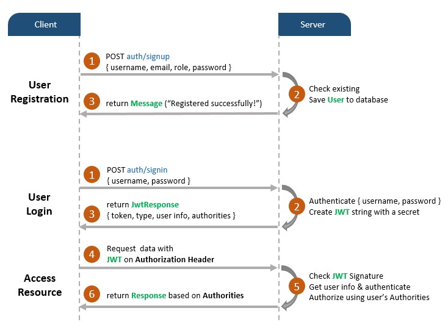
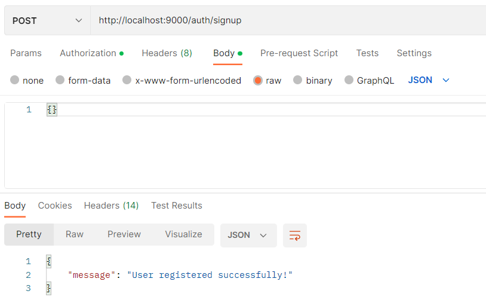
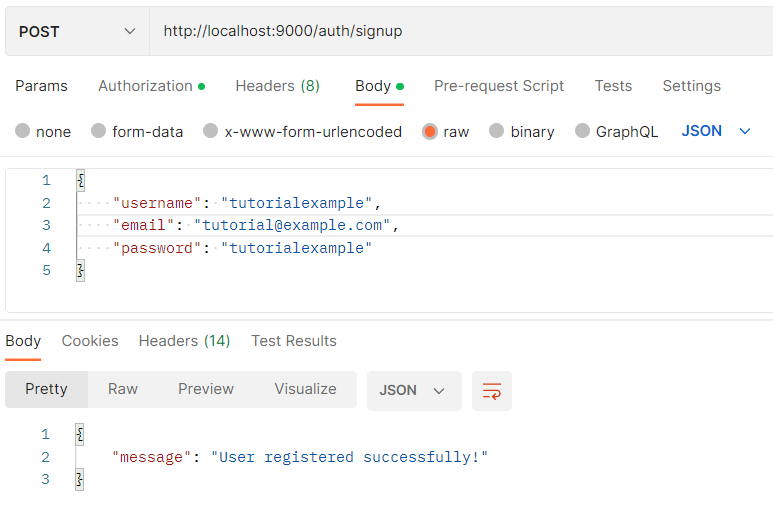
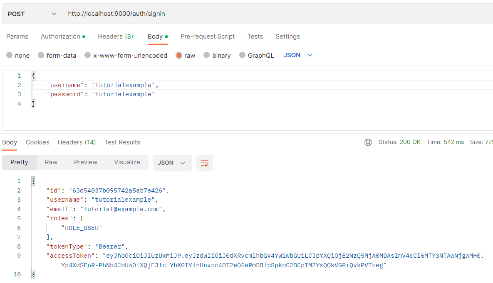
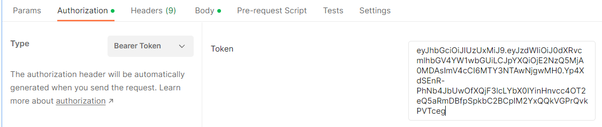
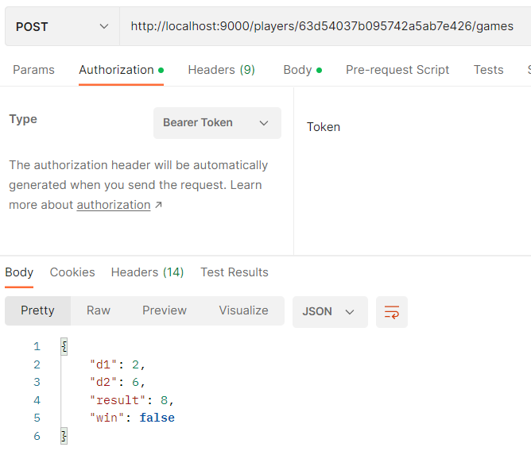
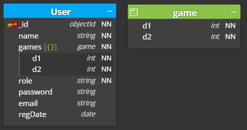
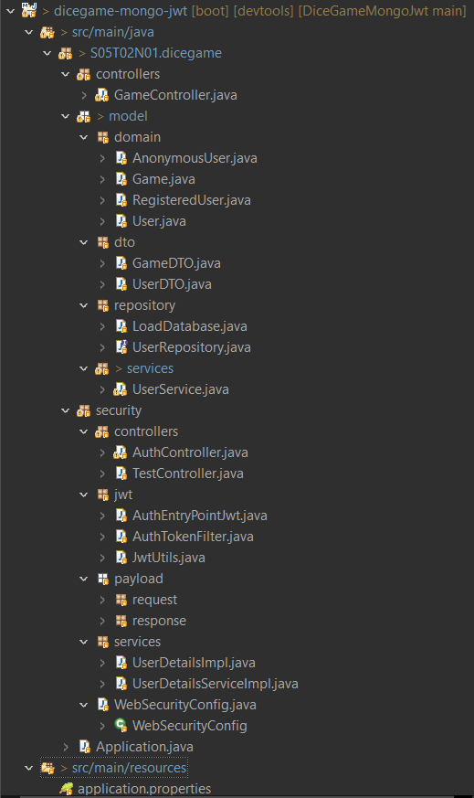
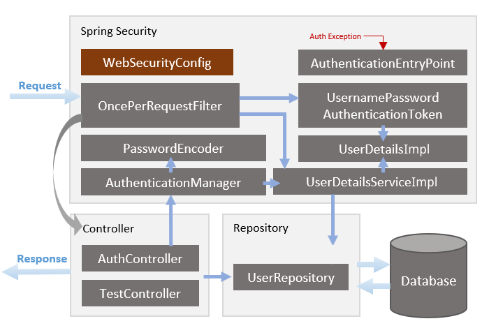
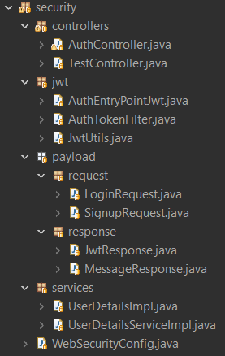

# DiceGameMongoJwt

## Introduction

The Dice Game is played with two dice. It is won when the sum of the two dice in a roll is equal to 7. Otherwise, the game is lost.

To play and roll it is needed to sign up the user with a unique username and email. There exists the possibility to play as an anonymous user introducing no data when registering. In this case, there is no need to log in the user, they can play without any problem. 

These are the possible actions of the API

| Methods | URLs | Actions |
| :---:   | :--- | :------ |
| POST | /auth/signup| creates a user |
| POST | /auth/signin | Inits the session of a registered user |
| GET | /test/all| checks every type of user can access the public content |
| GET | /test/user| checks if the user info can be accessed because it is logged in |
| GET | /test/anonymous | checks if the anonymous info can be accessed because there is no user logged in | 
| GET | /currentuser | returns the current logged in user or the last anonymous user if there is no logged in user | 
| GET | /players | list all players with their average success percentage |
| PUT | /players | updates the username of a registered user |
| GET | /players/{id}/games | list all games of the player with the specified id |
| POST | /players/{id}/games | the player with the specified id rolls |
| DELETE | /players/{id}/games | deletes the rolls of the player with the specified id |
| GET | /players/ranking | returns the total average success percentage of all users in the system |
| GET | /players/ranking/loser | returns the player with worst average success percentage | 
| GET | /players/ranking/winner | returns the player with best average success percentage |

Obviously, any action depending on an id is not allowed to do by a user which id is different than the given one in the path.

## Security

To assure the program encodes the password of the user and keeps all their information secretly, the API uses an authentication and authorization request and response process with the JSON Web Token (JWT) and Spring Boot Security dependencies.

I followed the [Bezcoder Tutorial](https://www.bezkoder.com/spring-boot-jwt-auth-mongodb/) to implement all the security.

### JWT  Authentication Flow

As given in the [Bezcoder Tutorial](https://www.bezkoder.com/spring-boot-jwt-auth-mongodb/), this is the authentication flow.

The process to sign up and sign in follos the next steps:

1. Introduce the URL `localhost:9000/auth/signup` as a POST method with the corresponding user body (username, email, password).

  -  Anonymous user:

  - Registered user:

The server checks the information introduced is correct and returns the Message "Registered successfully!") if everything is OK.
        
2. Introduce the URL `localhost:9000/auth/signin` as a POST method with the corresponding login body (username, password). (Do not apply this step if the user is anonymous)

The server generates the token and gives the corresponding authorities to the user. Then, it returns this info to the user.

3. Copy the given token when login and paste it in the Authorization Header as a Bearer Token (Do not apply this step if the user is anonymous)

4. Do every action with the token introduced and the server checks everything is OK and return what is defined by the API if the user is allowed.

### Project Organisation

The mongo model is very simple.

The fields `email`, `password` and `regDate` can be `null` because the anonymous user do not save this information.

There is no need to save the average success percentages since they are computed at the exact moment they are requested to be shown. There is also extra information util for the user but not needed to be in the database, like the result of the sum of the dice and if the game has been won or not. Therefore, there are DTO classes implemented for the User and Game classes, showing this extra information and also deleting the password, email, registration date and id of the users.

The files of the project are organised as shown in the next figure.

- To distinguish between the registered user and the anonymous user, there is an inheritance from the class User, which is the type of entity saved on the Mongo Repository.

- The `GameController` class works as the controller of the API, i.e., it defines the endpoints of the application and how they work. 

- The `UserRepository` class allows to manage the database in the program.

- The `LoadDatabase` class is just to load some initial data.

- The `UserService` class is a middle layer between the repository and the API. It allows to save and update all the date and convert it to DTO when requested. When the user requires the user or ranking information, it computes all the average success percentages.

All the security is explained in the next section.

### Security Architecture

The general security architecture is the next.

All the security is organised in the `security` folder like this.

Everything is configured by `WebSecurityConfig`. It defines the configuration for managing user sessions implementing `filterChain(HttpSecurity http)`. This method defines when to require authentication, the filter to use, when we want it to work, and which Exception Handler is chosen. 
  
We make use of @EnableWebSecurity and  @EnableGlobalMethodSecurity annotations to allow Spring to  apply the class to the global Web Security and enable @PreAuthorize to secure methods in the API.

When the user makes a request, it goes through the `AuthTokenFilter`, which extends OncePerRequestFilter. Therefore, the filter is executed once per request. It overrides `doFilterInternal()` to get JWT from the Authorization header, validate it, load `UserDetailsImpl` through `UserDetailsServiceImpl`, generate an Authentication Object with `UsernamePasswordAuthenticationToken` and set the current UserDetails in SecurityContext.

If there is an authentication error, `AuthEntryPointJwt` takes action and throws AuthenticationException. The response will be HttpServletResponse.SC_UNAUTHORIZED.

When everything has been checked by the filter, `AuthController` and `TestController` receive and handle the request. `AuthController` provides APIs for register and login actions and `TestController` has accessing protected resource methods with role based validations.

When login a user (`/auth/signin`), the `AuthController` makes use of the `AuthenticationManager` to validate UsernamePasswordAuthenticationToken and update SecurityContext using the returned object. It generates JWT and responses with it and UserDetails data

All authentication requests are managed by `LoginRequest` and `SignupRequest`, which assure all needed fields when login or signing up are filled correctly. There are also `JwtResponse` and `MessageResponse` classes to send HTTP responses with personalized body.

Everything can be done defining methods for generating, parsing, validating JWT on `JwtUtils`.

## Util links

- **Spring Boot, MongoDB: JWT Authentication with Spring Security** https://www.bezkoder.com/spring-boot-jwt-auth-mongodb/
- **Spring Data MongoDb for class inheritance** https://stackoverflow.com/questions/8794016/spring-data-mongodb-for-class-inheritance
- **Building REST services with Spring** https://spring.io/guides/tutorials/rest/
- **Spring Data MongoDB - Reference Documentation** https://docs.spring.io/spring-data/mongodb/docs/current-SNAPSHOT/reference/html/#reference
